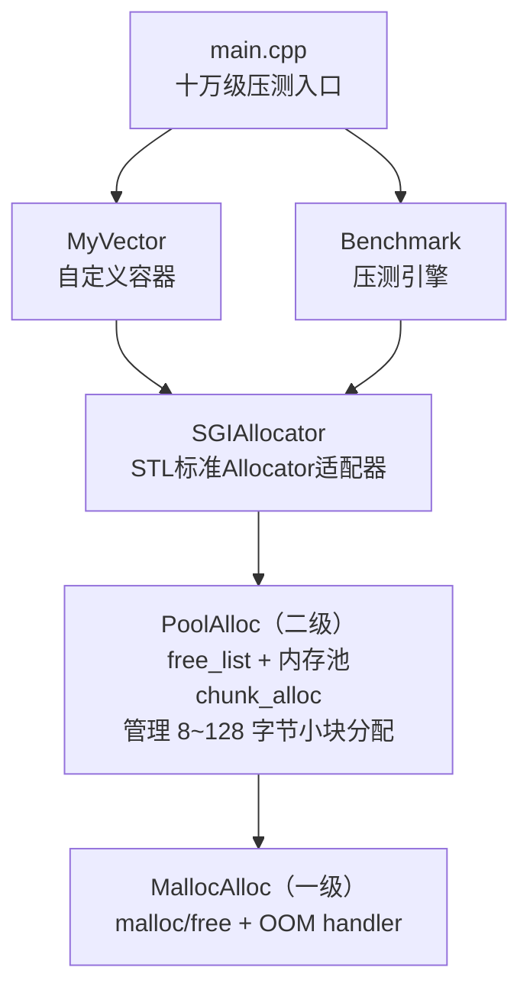

# SGI STL 内存池与空间配置器 — 百万级数据压测

## 一、项目目标

实现一个仿 SGI STL 的二级空间配置器（内存池），并自定义一个简易 vector 容器，对 "push_back" 和 "pop_back" 进行十万级数据压测，与 "std::allocator" 和 "std::vector" 做性能对比，验证内存池在高频小对象分配场景下的优势。

## 二、整体框架

## 三、各模块作用

|    模块    |      文件      |                作用                   |
| 一级配置器 | SGIAllocator.h | 封装 malloc/free，提供 OOM 处理机制     |
| 二级配置器 | SGIAllocator.h | 内存池 + 16 条 free_list，管理小块内存  |
| STL 适配器 | SGIAllocator.h |    符合 STL Allocator 规范的模板类     |
| 自定义容器 |   MyVector.h   |   三指针 vector，支持自定义 allocator   |
| 压测引擎   |   Benchmark.h  |       计时、结果统计、格式化输出         |
| 主程序     |    main.cpp    |        组装压测，输出三组对比           |

## 四、压测流程

1. 记录初始内存
2. 测试组 1: MyVector<int, SGIAllocator<int>>
   → push_back 100万次 (计时)
   → pop_back  100万次 (计时)
3. 测试组 2: MyVector<int, std::allocator<int>>
   → push_back 100万次 (计时)
   → pop_back  100万次 (计时)
4. 测试组 3: std::vector<int>（参照组）
   → push_back 100万次 (计时)
   → pop_back  100万次 (计时)
5. 记录结束内存
6. 输出对比表（时间 + 加速比 + 内存）

## 五、性能指标

- push_back 耗时 (ms)
- pop_back 耗时 (ms)
- 总耗时 (ms)
- 加速比 (Speedup = std时间 / SGI时间)
- 进程私有内存变化 (MB)

## 六、文件清单

src/
├── SGIAllocator.h     ← 实现一级 + 二级配置器 + STL 适配器
├── MyVector.h         ← 自定义 vector
├── Benchmark.h        ← 压测引擎
└── main.cpp           ← 主程序

## 六、编译方式

bash
cd 代码/
g++ -std=c++17 -O2 -o benchmark main.cpp -lpsapi
./benchmark

